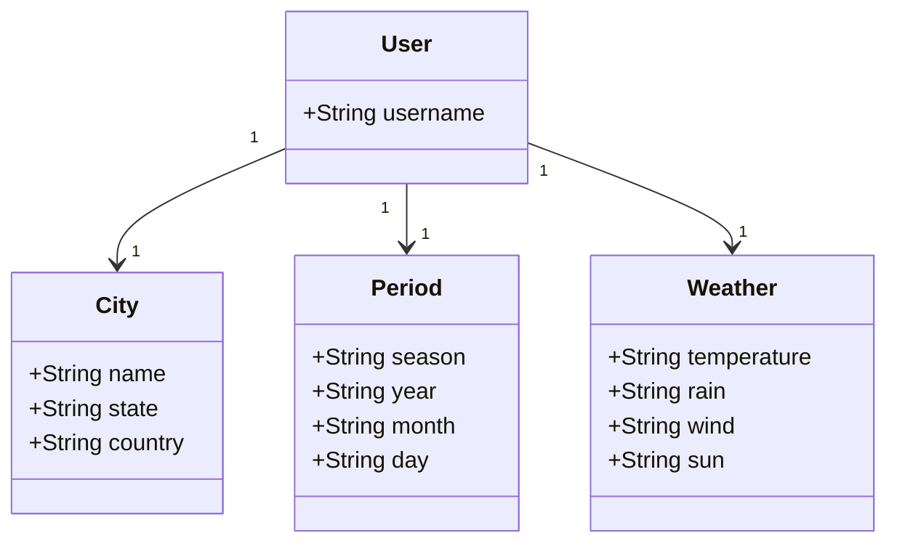

# Diagrama de Classes

```mermaid
classDiagram
    class User {
        +String username
    }

    class City {
        +String name
        +String state
        +String country
    }

    class Period {
        +String season
        +String year
        +String month
        +String day
    }

    class Weather {
        +String temperature
        +String rain
        +String wind
        +String sun
    }

    User "1" --> "1" City
    User "1" --> "1" Period
    User "1" --> "1" Weather
```
